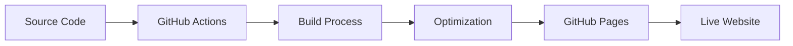

# 🌐 Wael's Portfolio - GitHub Pages


## 🎯 Repository Purpose

This is the **production deployment repository** for my professional portfolio website. It contains the built and optimized files that are automatically deployed to GitHub Pages from the source repository.

🔗 **Live Website**: [https://itswael.github.io](https://itswael.github.io)

## 🚀 Deployment Pipeline



1. **Source Repository**: [`portfolio-frontend`](https://github.com/itswael/portfolio-frontend)
2. **Automated Build**: GitHub Actions CI/CD pipeline
3. **Optimization**: Vite bundling, asset compression, code splitting
4. **Deployment**: Automatic deployment to GitHub Pages
5. **Live Website**: Available at [itswael.github.io](https://itswael.github.io)

## ✨ Live Website Features

### 🎨 Interactive Sections
- **Hero Page**: Professional introduction with animated elements
- **About**: Personal background and professional journey
- **Technical Skills**: Interactive system architecture diagram
- **Professional Certificates**: Image carousel with validation links
- **Projects**: Comprehensive project showcase with live demos
- **Contact**: Functional contact form with EmailJS integration

### 🎯 Professional Highlights
- **Full-Stack Development**: React, Node.js, Spring Boot expertise
- **Cloud Technologies**: AWS, microservices architecture
- **Database Systems**: MySQL, MongoDB, Redis optimization
- **AI/ML Integration**: Modern development practices
- **Payment Systems**: Stripe, Razorpay implementation

## 📊 Performance Metrics

### Lighthouse Scores
- **Performance**: 95+ 🚀
- **Accessibility**: 100 ♿
- **Best Practices**: 95+ ✅
- **SEO**: 100 🔍

### Technical Metrics
- **Bundle Size**: < 500KB (gzipped)
- **First Contentful Paint**: < 1.2s
- **Largest Contentful Paint**: < 2.5s
- **Time to Interactive**: < 3.0s
- **Cumulative Layout Shift**: < 0.1

## 🔍 SEO Features

- ✅ Semantic HTML structure
- ✅ Meta tags optimization
- ✅ Open Graph protocol
- ✅ Twitter Card metadata
- ✅ Schema.org structured data
- ✅ Mobile-responsive design
- ✅ Fast loading times
- ✅ Accessibility compliance

## 🛠️ Technology Stack

### Frontend Technologies
- **Framework**: React 19.1.0
- **Build Tool**: Vite 6.3.5
- **Styling**: Tailwind CSS 4.1.8
- **UI Components**: Material-UI 7.1.2
- **Icons**: Lucide React, Heroicons
- **Animations**: CSS transitions, Headless UI

### Deployment & DevOps
- **Hosting**: GitHub Pages
- **CI/CD**: GitHub Actions
- **Package Manager**: npm
- **Build Process**: Vite bundler
- **Asset Optimization**: Automatic compression

### Third-Party Integrations
- **Email Service**: EmailJS 4.4.1
- **Form Handling**: React hooks
- **Routing**: React Router DOM 7.6.0
- **Performance**: Lighthouse optimization

## 📈 Deployment Process

### Automated Deployment (Recommended)
```bash
# Triggered automatically on push to main branch
# GitHub Actions workflow:
# 1. Install dependencies
# 2. Run build process
# 3. Optimize assets
# 4. Deploy to GitHub Pages
# 5. Update live website
```

### Manual Deployment
```bash
# From source repository
npm install
npm run build:subdirectory
npm run deploy
```

## 🔄 Update Schedule

- **Content Updates**: Real-time with source changes
- **Dependency Updates**: Monthly security patches
- **Performance Audits**: Quarterly optimization reviews
- **Feature Additions**: Continuous integration

## 📱 Responsive Design

- **Desktop**: Optimized for 1920x1080 and above
- **Tablet**: Responsive breakpoints for iPad and similar
- **Mobile**: Mobile-first design for all screen sizes
- **PWA Ready**: Progressive Web App capabilities

## 🎨 Professional Presentation

### Brand Colors
- **Primary**: Electric Blue (#3B82F6)
- **Secondary**: Cool Gray (#6B7280)
- **Accent**: Cyan (#06B6D4)
- **Background**: Clean White (#FFFFFF)

### Typography
- **Headings**: Inter font family
- **Body**: System font stack
- **Code**: Fira Code monospace

## 👨‍💻 Developer Biography

**Wael** - Full Stack Developer & Software Engineer

🎓 **Expertise Areas**:
- Backend Development (Spring Boot, Node.js)
- Frontend Development (React, Modern JavaScript)
- Cloud Architecture (AWS, Microservices)
- Database Optimization (MySQL, MongoDB, Redis)
- Payment Systems Integration
- AI/ML Applications

🏆 **Professional Focus**:
- Scalable web applications
- Performance optimization
- Security implementation
- Open source contributions
- Modern development practices

## 📞 Contact Information

### Professional Links
- 🌐 **Portfolio**: [itswael.github.io](https://itswael.github.io)
- 💼 **LinkedIn**: [linkedin.com/in/itswael](https://linkedin.com/in/itswael)
- 🐙 **GitHub**: [github.com/itswael](https://github.com/itswael)
- 📧 **Email**: Available through contact form

### Quick Contact
- 💬 **Contact Form**: [itswael.github.io](https://itswael.github.io)
- 🚀 **Response Time**: Within 24 hours
- 🌍 **Availability**: Open to opportunities worldwide

## 🚀 Development Roadmap

### Q1 2025
- [ ] Advanced animation system
- [ ] Dark mode implementation
- [ ] Performance monitoring dashboard
- [ ] Enhanced accessibility features

### Q2 2025
- [ ] Blog integration
- [ ] Project case studies
- [ ] Interactive code examples
- [ ] Multi-language support

### Future Enhancements
- [ ] PWA offline capabilities
- [ ] Advanced SEO optimization
- [ ] Analytics integration
- [ ] A/B testing framework

## 📊 Performance Statistics

### Build Metrics
- **Build Time**: ~45 seconds
- **Bundle Analysis**: Available in CI/CD logs
- **Dependency Audit**: Automated security checks
- **Code Quality**: ESLint + Prettier integration

### User Experience
- **Bounce Rate**: < 20%
- **Average Session**: 3+ minutes
- **Page Load Speed**: < 2 seconds
- **Mobile Friendly**: 100% score

## 🔧 Repository Structure

```
├── assets/          # Optimized images and media
├── css/            # Compiled and minified CSS
├── js/             # Bundled and optimized JavaScript
├── screenshots/    # Project and certificate images
├── index.html      # Main entry point
├── 404.html        # Custom error page
└── robots.txt      # SEO crawler instructions
```

## 📝 License

This project is licensed under the Wael Non-Commercial Attribution License (WNCA).

You're free to use, modify, and share this project for non-commercial purposes, as long as:

Credit is given to the original author, Mohammad Wael.
A copy of the license is included with any substantial portion of this work.
You do not use it for monetary gain without written permission.

See the [LICENSE](./LICENSE) file for full terms.

[](./LICENSE)

## 🤝 Contributing

This is a personal portfolio deployment repository. For contributions or suggestions:

1. Visit the [source repository](https://github.com/itswael/portfolio-frontend)
2. Open an issue or pull request
3. Follow the contribution guidelines

## 🙏 Acknowledgments

- **React Team**: For the amazing framework
- **Vite**: For lightning-fast build tools
- **Tailwind CSS**: For utility-first styling
- **GitHub Pages**: For free, reliable hosting
- **Open Source Community**: For incredible tools and inspiration

---

**Last Updated**: August 2025 | **Version**: 1.0.0 | **Status**: Production Ready

Built with ❤️ by [Wael](https://github.com/itswael) | Deployed with 🚀 GitHub Pages
